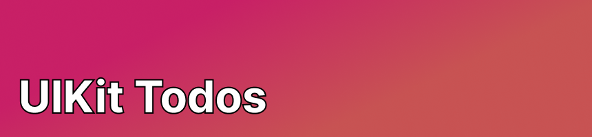
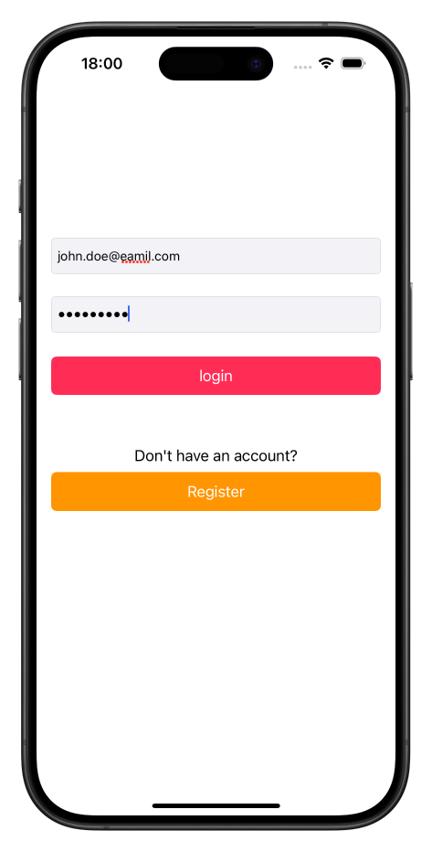
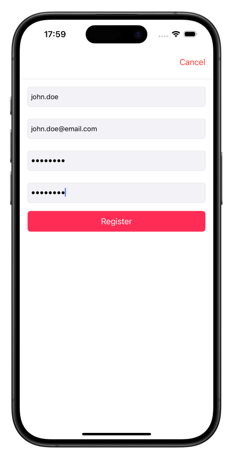
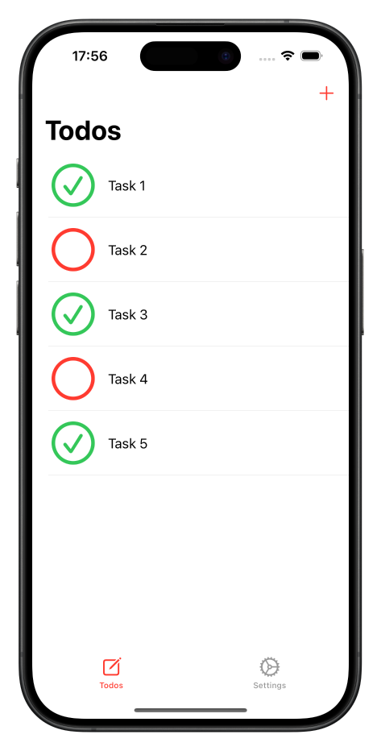
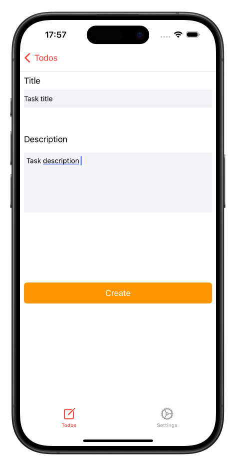
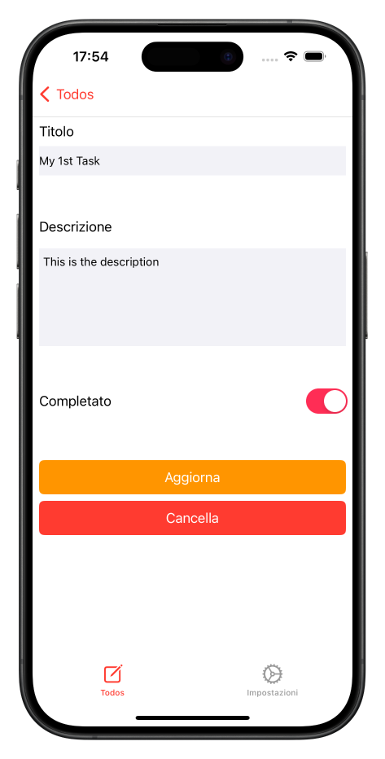
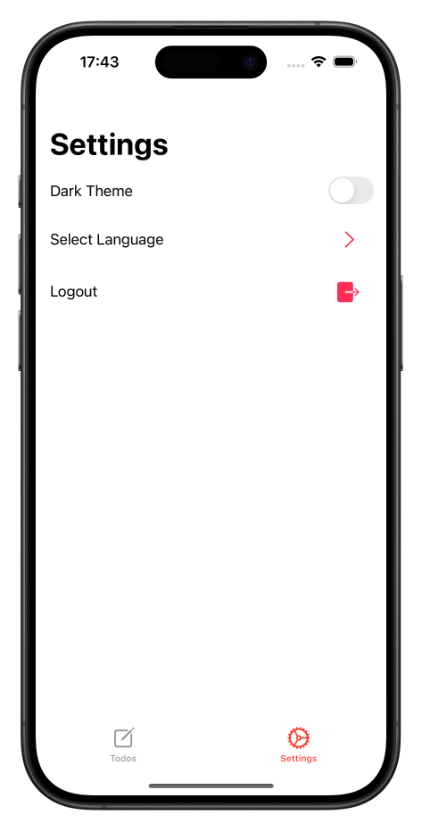
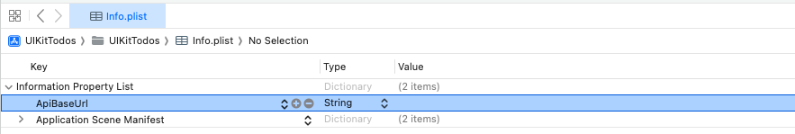

# **Description:**

`UIKit Todos is an iOS app developed for educational purposes` to practice with the UIKit framework.  
The purpose of the application is to organize your tasks by keeping track of them and marking completed tasks.

> **NOTE:** This application relies on a Backend API which you can find here: [Todos Backend API](https://github.com/FlavioVizza/ws-node-todos)

# **Features:**

- **Login**: Access your todo list using email and password
- **Register** a new account: create a new account specifying username, email, and password

- Through the **todo list page**, users can view their list of todo items

- Through the **todo detail page**, users can:
  - **Create Todo** items: Add new tasks to the todo list with title and description.
  - **Update Todo** items: Modify the status, title, and description of a to-do item through the detail page
  - **Delete Todo** items: Delete an existing Todos item through the detail page

- Through the **settings page**, users can:
  - Choose the **UI theme**: Choose between light or dark theme
  - Change **language** (currently available only in English and Italian)
  - **Log out**

    
    
    
    
    
    

# Technologies Used:
- Programming Language: Swift
- Framework: UIKit
- Architecture: MVC (Model-View-Controller)
- Data Persistence: UserDefault and Keychain
- View Management: Storyboard

# System Requirements:
- iOS devices with iOS 16.0 or later
- Optimized for iPhone

# Installation:
1. Clone the repository to your local machine.
2. Open the project in Xcode.
3. Add the base URL of the Todos API in the info.plist file.
4. Run the application on an iOS simulator or device. 🚀

Thank you for your interest in the UIKit Todos app! 😎